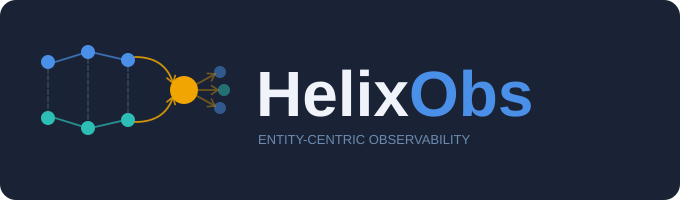

<div style="background:#1a2335; border-radius:12px; padding:24px 32px; margin-bottom:32px;">
  
</div>

**Entity-centric observability for scientific instrument pipelines.**

## What is an Entity?

An **entity** is any data product your pipeline creates, transforms, or consumes — a raw observation, a detection candidate, a calibration solution, a science file. It has a stable string ID that you choose (a database key, a filename hash, a UUID) and that ID follows the product across every processing stage, compute node, and instrument that touches it.

Every entity accumulates:

- a **provenance graph** — which upstream entities it was derived from, and which downstream entities it produced
- a **trace** — the distributed [OpenTelemetry](https://opentelemetry.io/) trace of every processing stage
- **logs** — all log lines emitted while any stage was active, correlated by entity ID
- **events** — named domain milestones and errors attached at any stage

This is the core idea: instead of asking *"what did service X do?"*, you ask *"what happened to entity Y, across every service that touched it?"*

## Why entity-centric?

Standard observability tools track *requests* or *services*. Scientific pipelines produce *data products* that flow through dozens of asynchronous stages across many hosts over minutes or hours. A single product might touch a detection process, a filtering service, an archiver, and a catalog registration system before it is complete.

Distributed tracing alone cannot correlate these: the pipeline is not a single request — stages run independently and are not causally linked in the OTel sense. HelixObs solves this with an entity DAG: each data product is an entity, each processing stage records a provenance link to its inputs, and the herald assembles these links into a queryable graph.

## What you get

| | |
|---|---|
| **Provenance graph** | Full DAG of how each entity was produced — queryable via the Grafana Entity Inspector |
| **Correlated logs** | Every log line emitted while processing an entity carries its ID and trace ID — search across stages in one query |
| **Event timeline** | Named domain events (`helix.event.*`) and errors (`helix.error`) attached to entities and surfaced in Grafana |
| **Notifications** | Slack messages and GitHub issues opened automatically for errors, with dedup and rate limiting |
| **AI troubleshooting** | Sherlock investigates entity errors on demand: fetches logs, traces, provenance, and source code, then classifies the root cause |

## How it works

```
Instrument pipeline                 HelixObs stack
─────────────────                   ──────────────────────────────────
helixobs client library
  create() / operate()
  ─► BatchSpanProcessor   ─────────► Herald :4317 (gRPC)
                                       │  enrich spans
                                       │  resolve parent links
                                       │  write to TimescaleDB
                                       │  emit Prometheus metrics
                                       └─► OTel Collector :4317
                                             │
                                             ├─► Tempo  (traces)
                                             └─► Loki   (OTLP logs)

  configure_logging()
  ─► stdout JSON          ─────────► Alloy (Docker scrape)
                                       └─► Loki (sidecar logs)

                                     Prometheus (scrapes herald,
                                       sherlock, otel-collector…)

                                     Grafana
                                       datasources: Loki, Tempo,
                                         Prometheus, TimescaleDB
```

### The Herald

The **herald** is HelixObs's central intelligence layer — the only HelixObs-specific service an instrument pipeline talks to directly. It listens for OTLP spans on port `4317`, the standard OpenTelemetry port, so no custom protocol is required.

When a span arrives carrying `helix.entity.id`, the herald does the work that standard OTel cannot: it resolves parent IDs across process boundaries, writes the entity provenance graph to TimescaleDB, dispatches error notifications to Slack and GitHub, and forwards the enriched span batch onward to the standard OTel Collector. Spans without `helix.entity.id` are forwarded unchanged — the herald is fully transparent to non-HelixObs traffic.

From a pipeline team's perspective, the herald is a single endpoint to configure and forget. The `helixobs` client library handles the connection.

## Documentation structure

| | |
|---|---|
| [Platform Tour](tour.md) | Screenshots of every UI view — what you get after instrumenting |
| [Getting Started](getting-started.md) | Instrument your first pipeline in 5 minutes |
| [For Scientists & Developers](client/index.md) | Client library reference, logging modes, auth |
| [For Operators](operator/index.md) | Stack deployment, Alloy config, dashboards, notifications |
