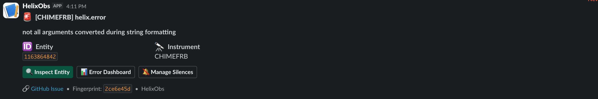
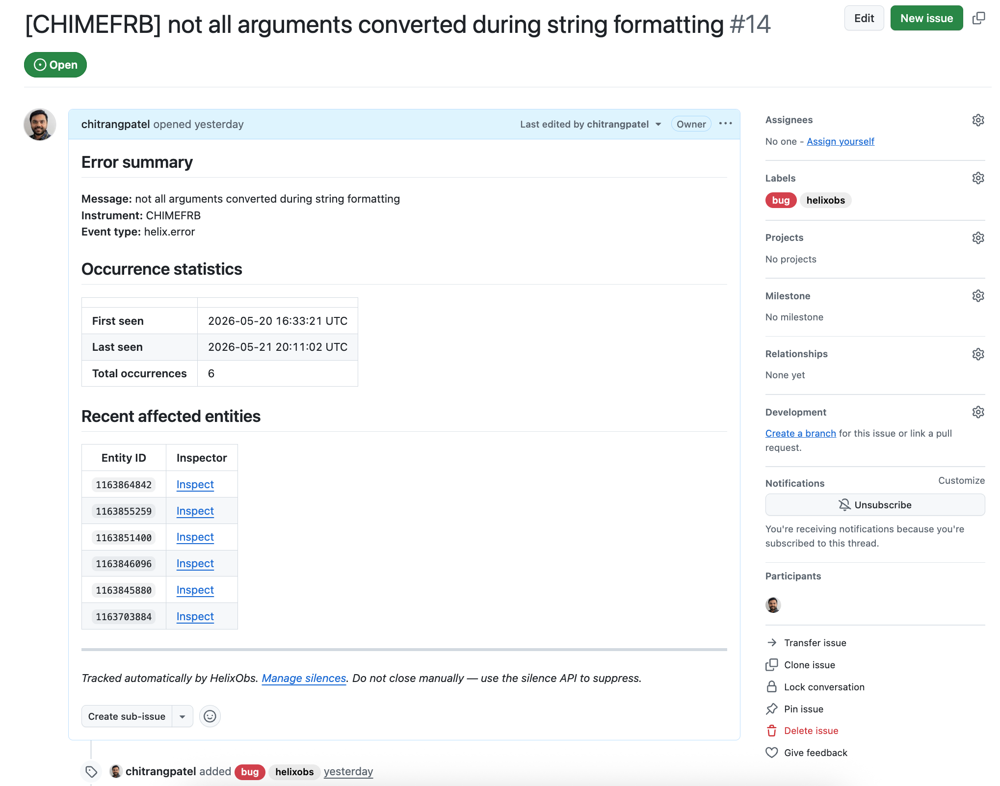
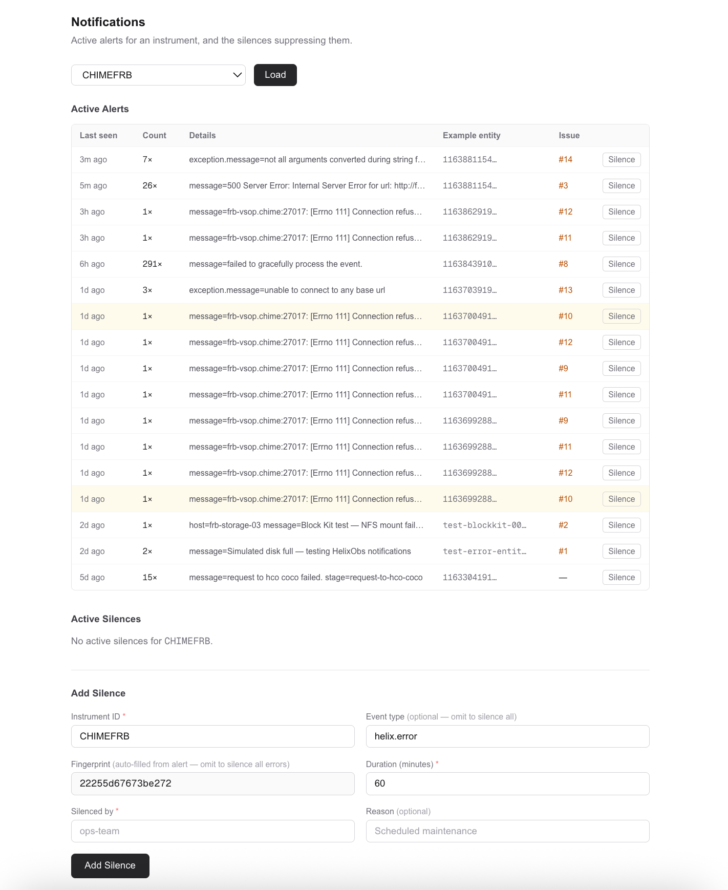
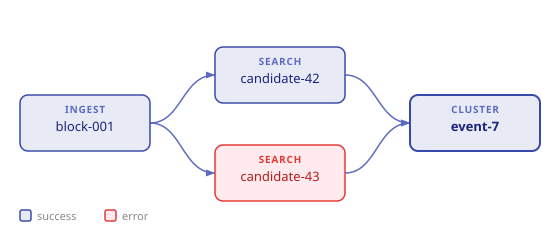
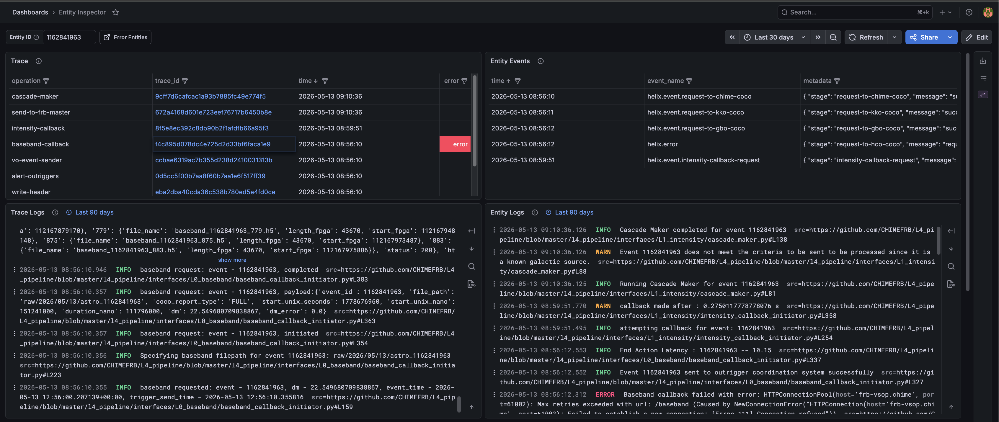
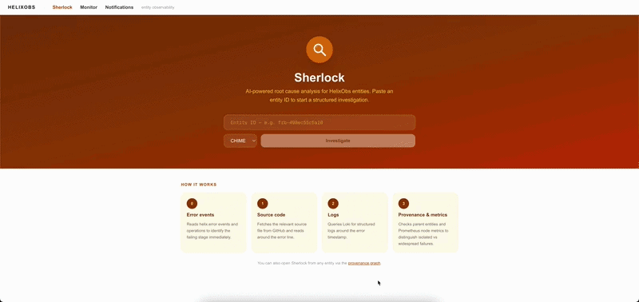
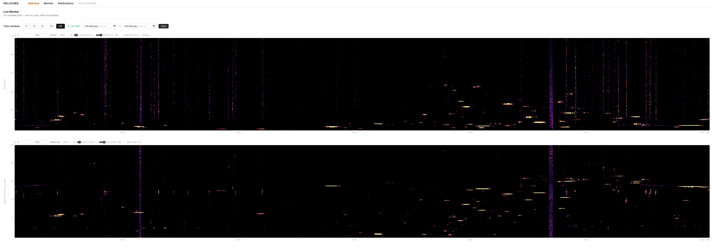

# Platform Tour

New here? Start with the [home page](index.md) for an introduction to what an entity is and why HelixObs is built around them.

This tour follows the journey of an on-call operator — from the moment a Slack alert fires to a resolved root cause.

---

## "I just got a Slack alert. What's broken?"

You receive a Slack message: a `helix.error` fired in the pipeline. The alert links directly to a **GitHub issue** that HelixObs opened automatically for this error class. The issue body shows the error summary, when it was first and last seen, how many times it has occurred, and a list of recent affected entity IDs.

<figure markdown>
  
  <figcaption>Slack alert with entity ID, error message, stage, and action buttons. The "Manage Silences" button links directly to the notifications page pre-filtered for this error fingerprint.</figcaption>
</figure>

<figure markdown>
  
  <figcaption>Auto-opened GitHub issue showing error summary, occurrence count, first/last seen timestamps, and the list of affected entities. The issue is closed automatically after a configurable quiet period.</figcaption>
</figure>

For a broader view of everything currently firing, open the [Notifications](operator/notifications.md) page. The **Active Alerts** table shows every distinct error class from the last 7 days — grouped by error type and pipeline stage, with occurrence counts and a link to the GitHub issue for each one.

If it's noise you recognise — a transient connection error, a known flapping service — you can silence it without touching any code. Click **Silence** on the row, set a duration, and it stops alerting you while you work on the real problem.

<figure markdown>
  
  <figcaption>Notifications page: active alerts, active silences, and the silence creation form. Navigating from a Slack alert pre-fills the instrument and fingerprint fields.</figcaption>
</figure>

---

## "What exactly happened to this entity, and why?"

Take an entity ID from the GitHub issue or the Alerts table and paste it into the [Entity Inspector](operator/dashboards.md#entity-inspector) to open the provenance graph for that entity.

<figure markdown>
  
  <figcaption>block-001 (ingested) was searched twice, producing two candidates. candidate-42 succeeded; candidate-43 failed. The surviving candidate was clustered into event-7. The error on candidate-43 is visible without opening a single log file.</figcaption>
</figure>

The graph shows you two things at once:

- **Where this entity came from** — its parent entities, their parents, and so on. You can trace back through every processing stage to the raw data that started the chain. Nodes with errors are highlighted so failures are visible at a glance.
- **What happened to it** — the events timeline lists every `helix.*` event emitted during the entity's lifetime, including the exact error message and the stage it came from. Correlated logs and the distributed trace waterfall are also available directly from this view.

<figure markdown>
  
  <figcaption>Entity Inspector: interactive provenance DAG, event timeline, and error summary for a selected entity.</figcaption>
</figure>

If the error needs deeper investigation, click **Diagnose with AI** to open a Sherlock session for that entity. Sherlock automatically fetches the relevant source code, pulls Loki logs for that entity ± 5 minutes, walks the provenance chain, and queries Prometheus for node-level metrics — then streams a root cause hypothesis to the UI. You can reply in the chat panel if Sherlock needs more context from you.

<figure markdown>
  
  <figcaption>Sherlock streaming a root-cause analysis: fetching logs, traces, and provenance, then classifying the error and suggesting a fix.</figcaption>
</figure>

Sherlock results are stored in instrument memory — the same investigation is replayed instantly on a recurrence without a new API call.

---

## "Is data even flowing through the pipeline right now?"

Before chasing an individual entity, it is worth knowing whether the pipeline is producing data at all. The [Data Monitor](operator/dashboards.md#data-monitor) answers that at a glance.

Select your instrument and add a panel for any numeric field your pipeline emits on every entity. A healthy pipeline produces a continuous band of points across the canvas. A gap means data stopped flowing: no entities were produced in that window. A thinning band means throughput dropped.

<figure markdown>
  
  <figcaption>Data Monitor: entity metadata fields plotted over time. A continuous band means data is flowing; a gap means something upstream stopped.</figcaption>
</figure>

If you see a gap or drop that coincides with your alert, the problem is upstream — something stopped feeding the pipeline — rather than a failure in one specific entity.

---

That is the core loop: **Slack alert → GitHub issue → Entity Inspector → Sherlock → Monitor**. Each tool answers the next question you would naturally ask.
