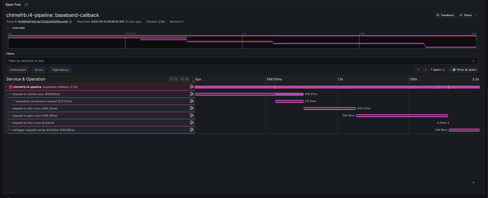
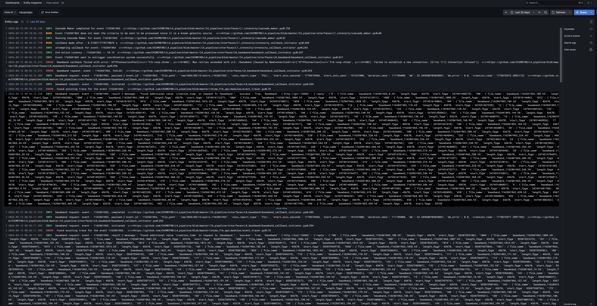

# Platform Tour

Once your pipeline is instrumented, HelixObs gives you eight things without any additional work. This page shows each of them.

---

## Provenance graph

Every entity accumulates a directed acyclic graph (DAG) of the entities it was derived from and the entities it produced. The links are declared in code — `parents=["block-001"]` — and the [herald](client/concepts.md#herald) assembles them across processes and hosts automatically.

<figure markdown>
  
  <figcaption>block-001 (ingested) was searched twice, producing two candidates. candidate-42 succeeded; candidate-43 failed. The surviving candidate was clustered into event-7. The error on candidate-43 is visible without opening a single log file.</figcaption>
</figure>

This is the answer to *"where did this data product come from, and what happened along the way?"* — resolved in one query.

---

## Entity Inspector

The [Entity Inspector](operator/dashboards.md#entity-inspector) is a Grafana panel that renders the provenance DAG interactively. Click any node to jump to that entity's trace, logs, and event timeline. Nodes with `helix.error` events are highlighted.

<figure markdown>
  
  <figcaption>Entity Inspector: interactive provenance DAG, event timeline, and error summary for a selected entity.</figcaption>
</figure>

---

## Distributed traces

Every entity spans maps to an [OpenTelemetry](https://opentelemetry.io/) trace visible in Grafana Tempo. The waterfall shows timing across all processing stages and any [child spans](client/tracking.md#child-spans) you've added for internal sub-steps.

<figure markdown>
  
  <figcaption>Tempo trace waterfall: every stage from ingest through archival, with child spans for internal sub-steps like RFI excision and dedispersion.</figcaption>
</figure>

---

## Correlated logs

Every log line emitted while a span is active carries `helix_entity_id` and `otel_trace_id`. Search Loki for any entity and get every log line from every process that touched it — no grep, no SSH, no node-hopping.

<figure markdown>
  
  <figcaption>Loki log panel filtered by entity ID. Logs from ingest, search, and archival processes appear in a single view, ordered by time.</figcaption>
</figure>

---

## Monitor

The Monitor page plots any entity metadata field as a time-series across all entities in a configurable time window. No separate dashboard setup required — any value you pass to `token.set_attribute()` or `complete(metadata=...)` is immediately queryable here.

<figure markdown>
  
  <figcaption>Monitor: detection score, DM, and processing latency plotted over time across all entities. Useful for catching pipeline drift without building custom dashboards.</figcaption>
</figure>

---

## Slack alerts

When a `token.error()` call is recorded, the [herald](client/concepts.md#herald) dispatches a Slack message with the error details, a direct link to the Entity Inspector, and a **Manage Silences** button that takes you to a pre-filtered silencing UI for that exact error fingerprint.

Repeated identical errors are rate-limited and digested — you get one message per window, not a flood.

<figure markdown>
  
  <figcaption>Slack alert with entity ID, error message, stage, and action buttons. The "Manage Silences" button links directly to the notifications page pre-filtered for this error fingerprint.</figcaption>
</figure>

Notifications are configured per instrument by your operator — see [Notifications](operator/notifications.md).

---

## GitHub issue tracking

If your instrument is configured with a GitHub repo, every distinct error fingerprint opens a GitHub issue automatically. The issue body tracks occurrence count, first/last seen, and the list of affected entity IDs — updated on every recurrence, not by adding new comments.

<figure markdown>
  
  <figcaption>Auto-opened GitHub issue showing error summary, occurrence count, first/last seen timestamps, and the list of affected entities. The issue is closed automatically after a configurable quiet period.</figcaption>
</figure>

---

## AI diagnosis with Sherlock

Click **Diagnose with AI** on any error entity in the Entity Inspector. Sherlock fetches logs, traces, provenance, and — if configured — the relevant source code, then streams a root-cause analysis directly to the UI. You can reply to ask follow-up questions.

<figure markdown>
  

    Animated GIF coming <code style="font-size:12px">docs/assets/screenshots/sherlock.gif</code>
  

  <figcaption>Sherlock streaming a root-cause analysis: fetching logs and source code, identifying the failing NFS mount, and classifying the error with a suggested fix.</figcaption>
</figure>

Sherlock results are stored in instrument memory — the same investigation is replayed instantly on a recurrence without a new API call.
